# AA3. IPFire-WebProxy

## Activitats

## Configura el proxy perquè realitzi les següents accions:

### Configuració inicial:

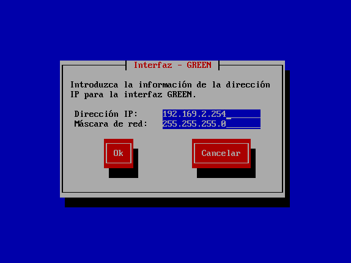
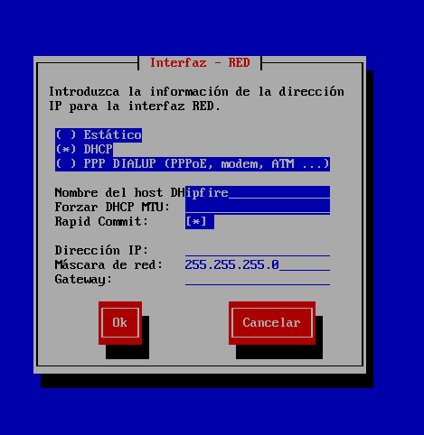
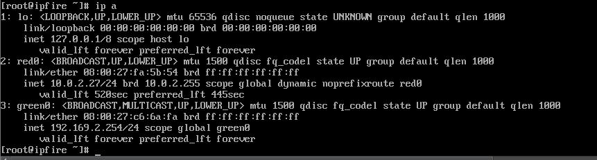
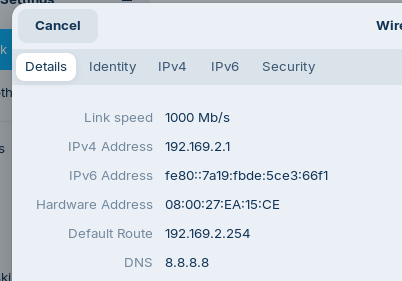
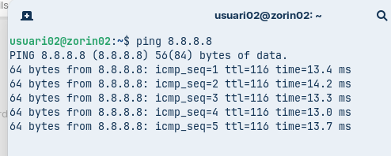
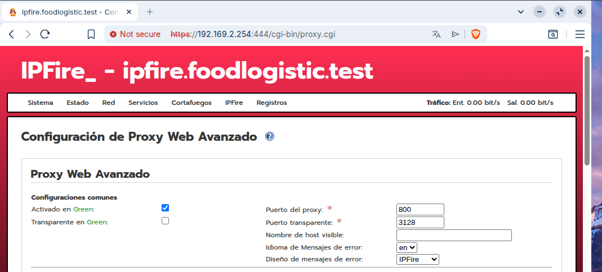

### – A la pàgina de bloqueig mostri la URL bloquejada. Prova a bloquejar una url concreta d’un domini però no la resta del domini.

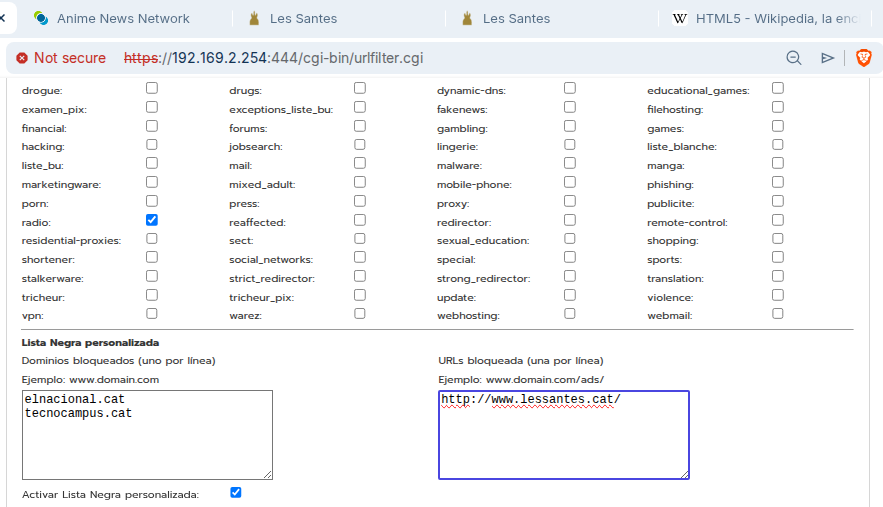
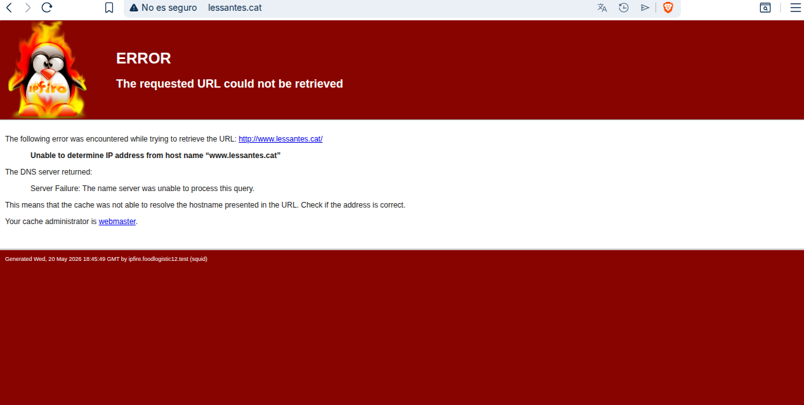

### – Instal·la les llistes negres. Blocar els dominis elnacional.cat i tecnocampus.cat.

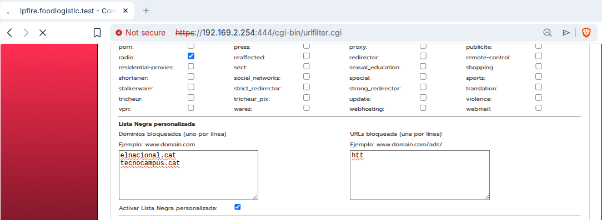
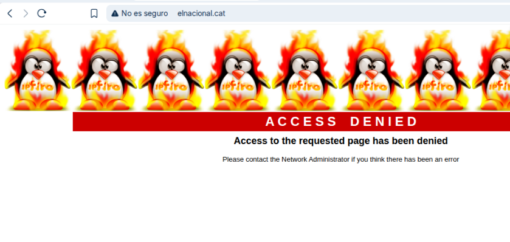
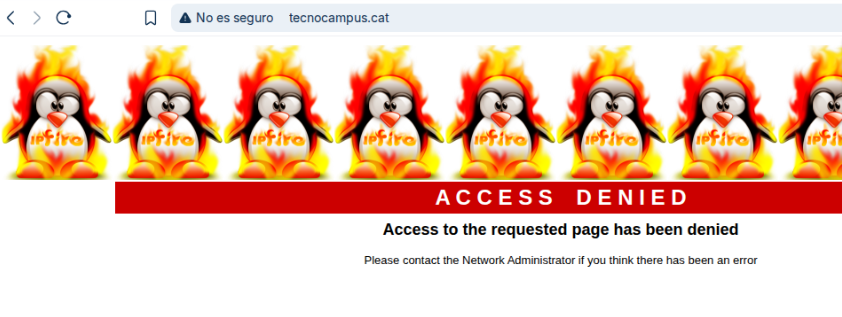

### – Blocar categories: bank i radio. Proveu-lo amb la pàgina de ing.es i ah.fm

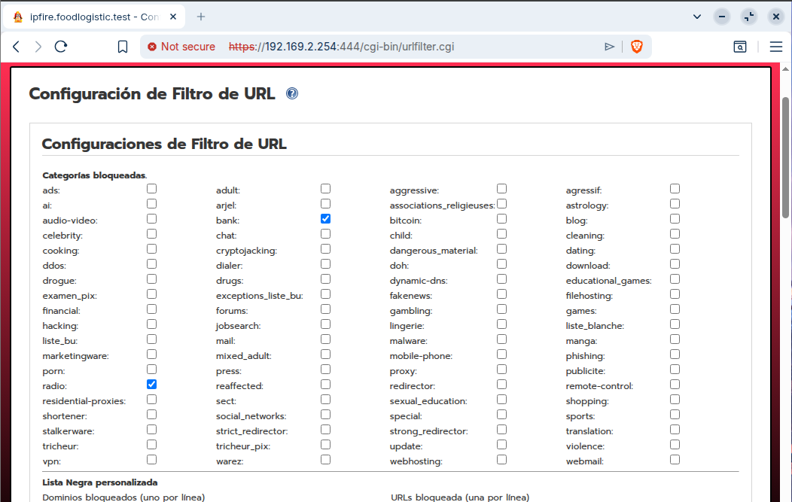
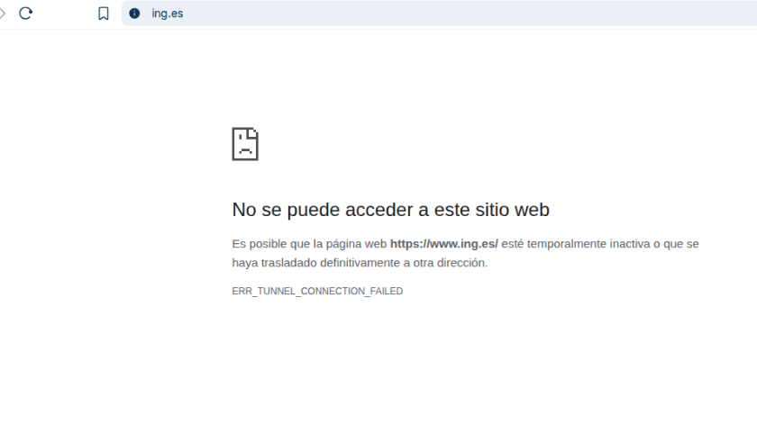
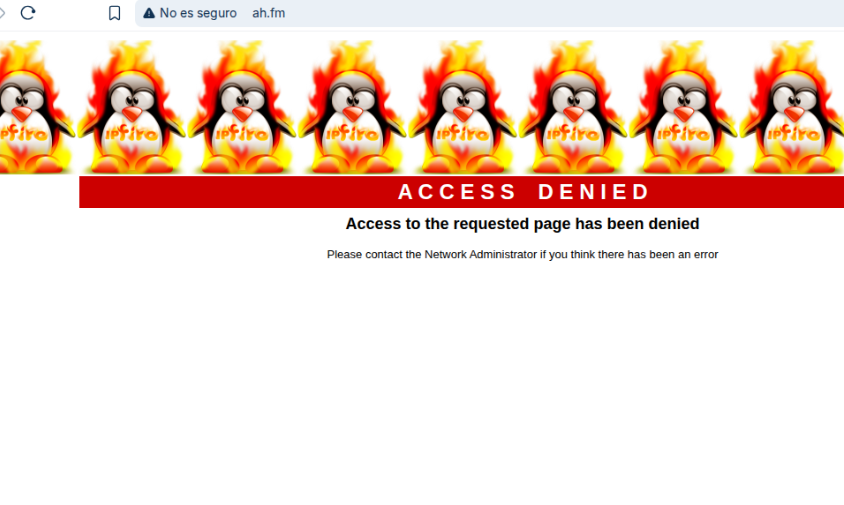

### – Blocar tota pàgina que contingui el terme anime, amb l’excepció del domini animenewsnetwork.com.

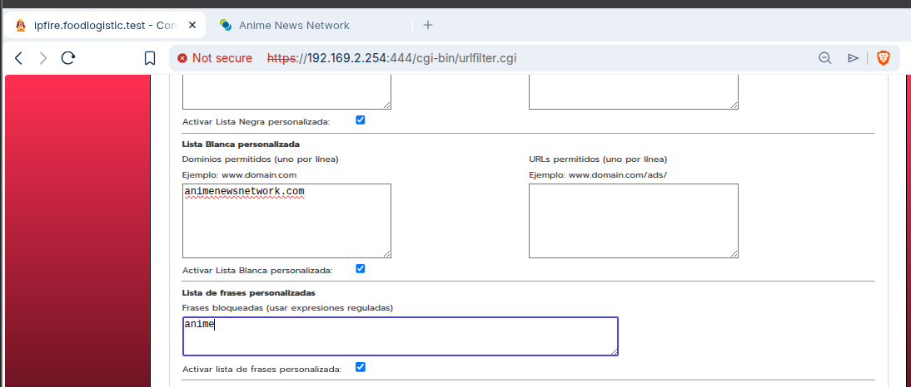
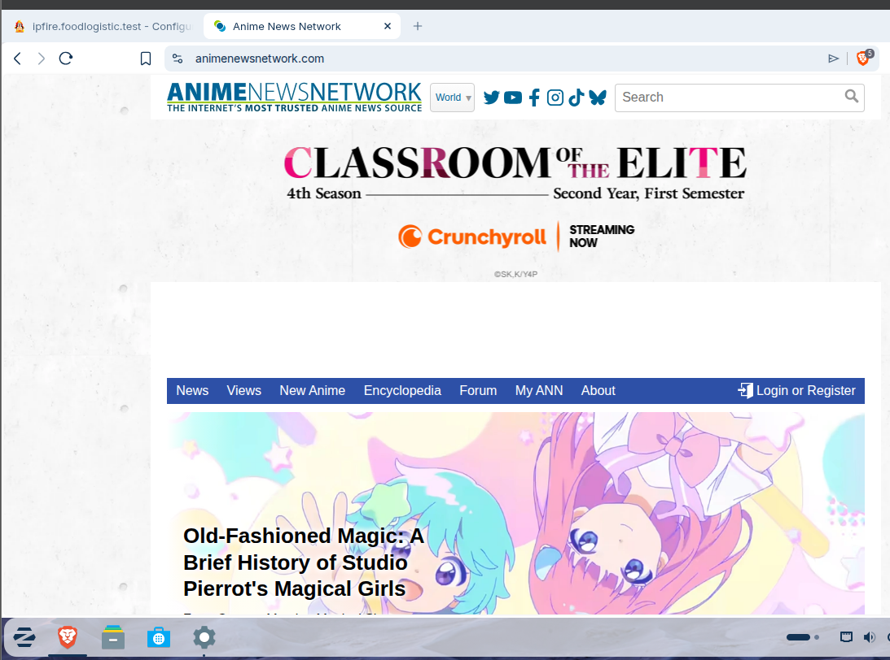
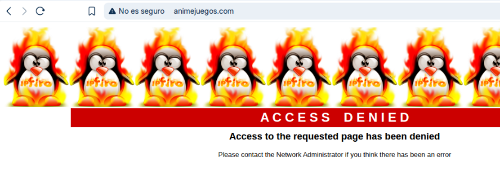

### – Prova bloqueig per hores.

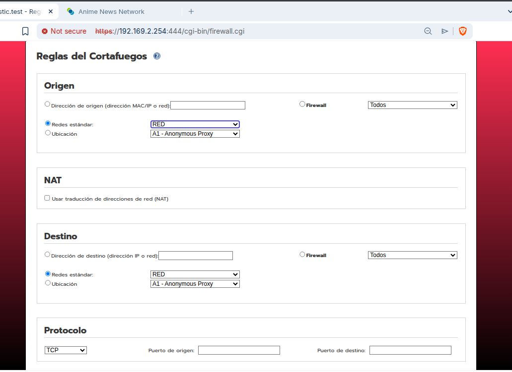
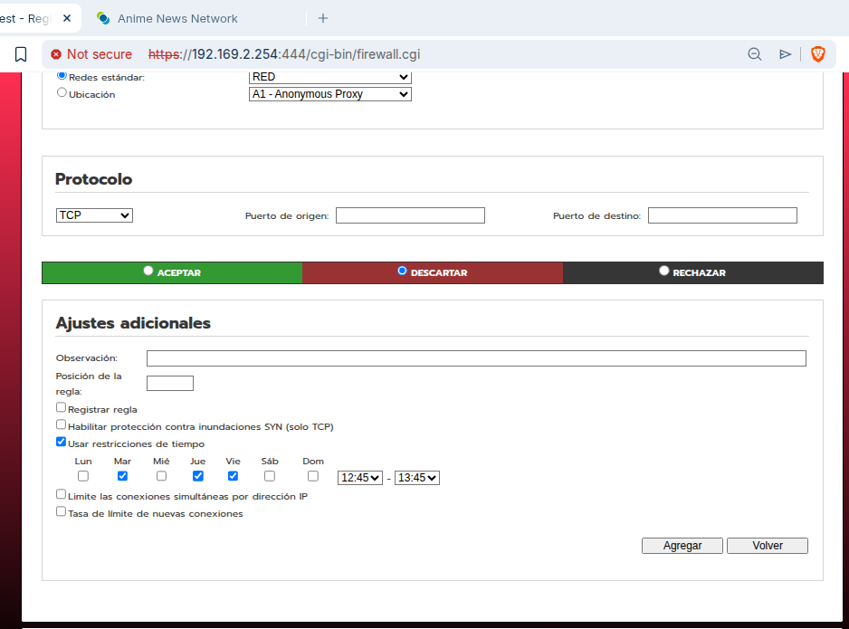
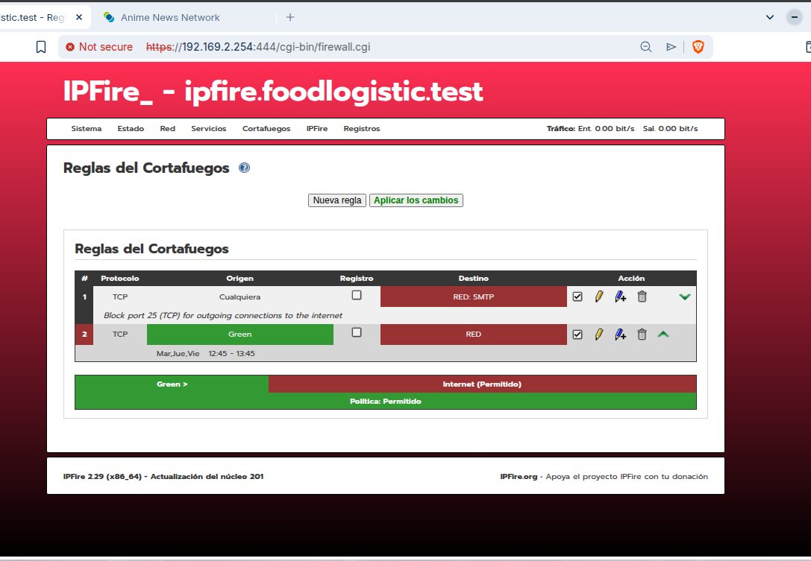
